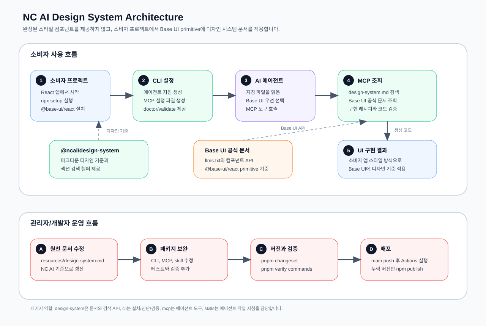

# NC AI Design System

NC AI Design System은 AI 에이전트가 React UI를 만들 때 사용할 수 있는 마크다운 우선 디자인 시스템 기반입니다. 원천 문서는 `resources/design-system.md`이며, 소비자 프로젝트에서는 완성된 스타일 컴포넌트를 받는 대신 Base UI primitive를 먼저 선택하고 이 문서의 디자인 기준을 즉석에서 적용합니다.

Base UI는 접근 가능한 React UI를 만들기 위한 unstyled 컴포넌트 라이브러리입니다. 이 프로젝트는 [Base UI](https://base-ui.com/)와 [Base UI Quick start](https://base-ui.com/react/overview/quick-start.md)의 흐름을 전제로 `@base-ui/react`를 사용합니다.

---

## 아키텍처

아래 그림은 소비자 프로젝트, AI 에이전트, npm 패키지, MCP 도구, Base UI 공식 문서, 관리자 배포 흐름이 어떻게 연결되는지 보여줍니다.



---

## 패키지 구성

- `@ncai/design-system`
  - `design-system.md` 원문과 섹션 검색 헬퍼를 배포합니다.
  - 소비자 프로젝트나 에이전트는 이 패키지를 통해 NC AI 디자인 기준을 코드에서 직접 조회하고, 필요한 섹션만 찾아 UI 구현에 반영할 수 있습니다.
- `@ncai/design-system-skills`
  - AI 에이전트가 NC AI 디자인 시스템과 Base UI를 함께 사용하는 방법을 이해할 수 있도록 지침 문서를 배포합니다.
  - 특정 도구에만 묶인 컴포넌트 구현체가 아니라, 에이전트가 Base UI primitive를 먼저 선택하고 디자인 시스템 문서를 적용하도록 안내하는 작업 기준을 제공합니다.
- `@ncai/design-system-mcp`
  - NC AI 디자인 시스템 검색, Base UI 공식 문서 조회, 구현 레시피 생성, UI 코드 검증을 위한 MCP 도구를 제공합니다.
  - 에이전트는 MCP를 통해 `design-system.md`와 Base UI API 문서를 함께 확인하고, 임의 스타일이나 오래된 import 같은 문제를 검증할 수 있습니다.
- `@ncai/design-system-cli`
  - `npx`로 실행할 수 있는 설치, 에이전트 지침 생성, MCP 설정, 진단, 검증, 문서 조회 명령을 제공합니다.
  - 소비자 프로젝트에서 `setup`, `show`, `doctor`, `validate` 명령을 사용해 디자인 시스템 적용 환경을 빠르게 구성하고 점검할 수 있습니다.

---

## 사용법

### 설치와 에이전트 설정

소비자 프로젝트에서는 먼저 사용할 에이전트를 선택해 지침 파일과 MCP 설정을 생성합니다. `<agent>`에는 지원 목록 중 하나를 넣습니다.

```bash
npx @ncai/design-system-cli setup --agent <agent>
npm i @ncai/design-system @base-ui/react
```

`setup` 명령은 선택한 에이전트가 읽을 수 있는 지침 파일과 MCP 설정을 생성합니다. 자동 설정 형식이 안정적인 에이전트는 설정 파일을 직접 작성하고, 도구나 버전에 따라 설정 방식이 달라질 수 있는 에이전트는 `.ncai` 아래에 가져다 쓸 MCP JSON 스니펫을 생성합니다.

지원하는 에이전트는 다음과 같습니다.

- `cursor`: `.cursor/skills/ncai-design-system/SKILL.md`와 `.cursor/mcp.json`을 생성합니다.
- `vscode`: `.github/copilot-instructions.md`와 `.vscode/mcp.json`을 생성합니다.
- `claude`: `CLAUDE.md`와 `.mcp.json`을 생성합니다.
- `codex`: `AGENTS.md`와 `.ncai/codex-mcp.json`을 생성합니다.
- `windsurf`: `.windsurfrules`와 `.ncai/windsurf-mcp.json`을 생성합니다.
- `jetbrains`: `.ncai/jetbrains-agent-instructions.md`와 `.ncai/jetbrains-mcp.json`을 생성합니다.
- `manual`: `.ncai/agent-instructions.md`와 `.ncai/manual-mcp.json`을 생성합니다.

예시는 다음과 같습니다.

```bash
npx @ncai/design-system-cli setup --agent claude
npx @ncai/design-system-cli setup --agent vscode
```

### 디자인 시스템 문서 조회

`show`는 패키지에 포함된 `design-system.md`를 터미널에서 확인하는 명령입니다. `--query`를 넣으면 관련 섹션만 검색해서 보여주고, `--query`가 없으면 전체 문서를 출력합니다. 에이전트가 MCP를 사용할 수 없는 환경에서 디자인 기준을 빠르게 확인할 때 사용합니다.

```bash
npx @ncai/design-system-cli show --query buttons
npx @ncai/design-system-cli show --query typography
```

### 설치 상태 진단

`doctor`는 소비자 프로젝트에 필요한 의존성과 에이전트 설정 파일이 있는지 확인하는 진단 명령입니다. `@ncai/design-system`, `@base-ui/react`, 에이전트 지침 파일, MCP 설정 파일의 존재 여부를 확인합니다.

```bash
npx @ncai/design-system-cli doctor
```

다른 위치를 프로젝트 루트로 검사하려면 `--cwd`를 사용합니다.

```bash
npx @ncai/design-system-cli doctor --cwd ./apps/web
```

### UI 코드 검증

`validate`는 생성된 UI 코드가 기본 가드레일을 어기지 않았는지 확인합니다. 예를 들어 이전 Base UI 패키지명 사용, Base UI로 만들 수 있는 인터랙티브 UI를 직접 만든 흔적, 디자인 시스템 근거가 필요한 직접 색상값 등을 점검합니다.

```bash
npx @ncai/design-system-cli validate --file src/App.tsx
```

---

## 에이전트 작업 흐름

AI 에이전트가 UI를 만들거나 리뷰할 때는 다음 순서를 따릅니다.

1. `design-system.md`를 읽거나 MCP로 검색합니다.
2. 인터랙티브 UI는 가장 가까운 Base UI primitive를 `@base-ui/react`에서 선택합니다.
3. 필요한 경우 MCP의 `search_base_ui_docs` 또는 `get_base_ui_component_doc`으로 Base UI 공식 Markdown 문서를 확인합니다.
4. Base UI의 접근성 구조와 상태 속성을 유지합니다.
5. 마크다운 문서의 typography, color, spacing, radius, elevation, interaction 기준을 소비자 프로젝트의 스타일 방식에 맞게 적용합니다.
6. MCP `validate_ui_code` 또는 CLI `validate`로 결과를 점검합니다.

MCP를 사용할 수 있다면 다음 도구를 우선 사용합니다.

- `get_design_system_overview`: NC AI 디자인 시스템 섹션 목록을 확인합니다.
- `search_design_system`: 요청과 관련된 디자인 시스템 섹션을 검색합니다.
- `get_design_system_section`: 특정 디자인 시스템 섹션의 원문을 확인합니다.
- `list_base_ui_docs`: Base UI 공식 문서 인덱스를 확인합니다.
- `search_base_ui_docs`: Base UI 공식 문서를 검색합니다.
- `get_base_ui_component_doc`: Base UI 컴포넌트 API 문서를 확인합니다.
- `compose_base_ui_recipe`: 요청에 맞는 Base UI 우선 구현 레시피를 생성합니다.
- `validate_ui_code`: 생성된 코드의 기본 가드레일을 점검합니다.

---

## 테스트 시나리오 예시

### 회원가입 화면으로 검증하기

외부 AI 에이전트에게 이 프로젝트를 테스트하도록 요청할 때는 다음처럼 요청할 수 있습니다.

```text
README를 읽고 NC AI Design System이 잘 반영되는지 확인하기 위해 React로 회원가입 화면을 만들어줘.
Base UI 컴포넌트를 우선 사용하고, 가능한 많은 적절한 컴포넌트를 사용해.
구현 후 디자인 시스템과 Base UI 사용 여부를 체크리스트로 검증해줘.
```

이 시나리오에서는 단순한 입력 폼만 만드는 것이 아니라, Base UI primitive와 디자인 시스템 적용 흐름이 함께 검증되어야 합니다.

권장 Base UI 후보는 다음과 같습니다.

- `Form`, `Field`, `Input`: 이름, 이메일, 비밀번호, 에러 메시지 입력 구조
- `Checkbox`: 약관 동의 또는 마케팅 수신 동의
- `Select`: 국가, 직무, 관심 분야 같은 선택값
- `Button`: 제출, 취소, 보조 액션
- `Tooltip` 또는 `Popover`: 비밀번호 조건, 보조 설명
- `Dialog` 또는 `Alert Dialog`: 제출 확인, 약관 상세, 오류 안내
- `Toast`: 가입 성공 또는 실패 피드백

### 검증 체크리스트

테스트 결과는 다음 기준으로 확인합니다.

- Base UI primitive를 우선 사용했는가?
- 사용한 Base UI 컴포넌트의 공식 문서를 MCP로 확인했는가?
- `design-system.md`의 색상, typography, spacing, radius, elevation 기준을 반영했는가?
- label, description, error message, focus state 등 접근성 구조가 있는가?
- 임의 색상값, 근거 없는 shadow, 근거 없는 radius, 장식용 gradient를 만들지 않았는가?
- 소비자 프로젝트의 기존 스타일 방식에 맞게 스타일을 적용했는가?
- MCP `validate_ui_code` 또는 CLI `validate`를 실행했는가?
- 마지막 응답에서 사용한 Base UI 컴포넌트와 참고한 디자인 시스템 섹션을 요약했는가?

---

## 개발

로컬에서 패키지를 수정할 때는 의존성을 설치한 뒤 타입 검사, 테스트, 빌드, 검증을 순서대로 실행해 배포 가능한 상태인지 확인합니다.

```bash
pnpm install
pnpm typecheck
pnpm test
pnpm build
pnpm validate
```

패키지 배포는 `.github/workflows/release.yml`에서 검증 후 `scripts/publish-missing.mjs`를 실행하는 방식으로 진행합니다. 배포할 변경이 있을 때는 `pnpm changeset`으로 변경 내용을 기록하고 `pnpm version-packages`로 패키지 버전을 반영한 뒤 `main`에 푸시합니다. 배포 스크립트는 이미 npm에 배포된 동일 버전은 건너뛰고, 아직 배포되지 않은 패키지만 공개 패키지로 게시합니다.
